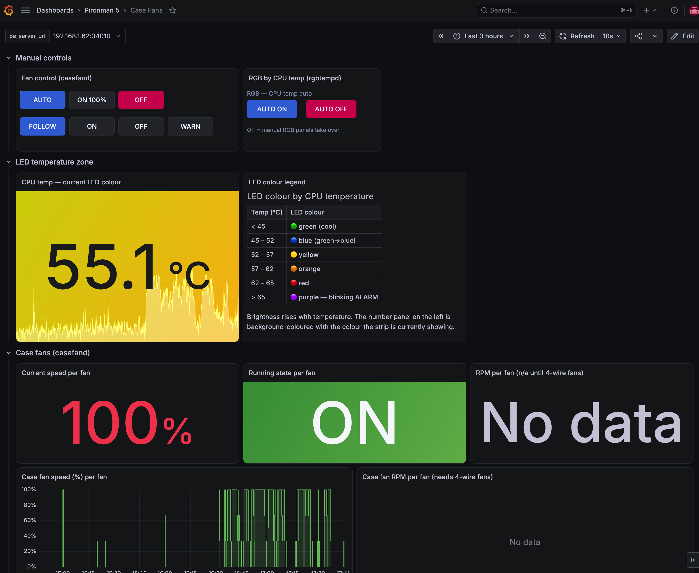

# pironman-extended

> An extension for [sunfounder/pironman5](https://github.com/sunfounder/pironman5).
> It runs alongside the official `pironman5` service and does not replace it.



One small service that extends a **SunFounder Pironman 5 / 5 Max** with the things
the stock firmware doesn't do, behind a single versioned HTTP API. Talks to the
stock `pironman5` service instead of fighting it, so the built-in dashboard/RGB
controls keep working.

## Features
- **Case-fan control** — speed curve + hysteresis for the GPIO case fan(s), silent
  on/off for 2-wire fans, true PWM + tach RPM for 4-wire fans (config-only upgrade).
- **Fan indicator LED (GPIO5/D2)** — driven independently of the fan: `follow` /
  `on` / `off` / `warn` (blinks on over-temp). It's a single-colour line, not RGB.
- **Temperature RGB** — colours the 4 onboard WS2812 LEDs by CPU temperature
  (green → blue → yellow → orange → red, purple **breathing alarm** above
  `rgb_warn_temp`), brightness ramping with temperature. Done via pironman's own
  API (`set-rgb-*`), only pushing on change, so the config file isn't thrashed.
- **Metrics** — per-fan speed/state/RPM to InfluxDB for Grafana.

## API (`/api/v1`)
| Method | Path | Body |
|---|---|---|
| GET | `/health`, `/status`, `/fans`, `/fans/<name>`, `/rgb` | — |
| POST | `/fans/<name>` | `{mode?: auto\|manual\|off, percent?, led_mode?: follow\|on\|off\|warn}` |
| POST | `/rgb` | `{enabled?: bool}` |

## Grafana dashboard
[`grafana/case-fans.json`](grafana/case-fans.json) is the **Case Fans** dashboard shown
above: fan and LED-mode buttons, the RGB auto toggle, CPU temperature coloured like the LEDs,
per-fan speed/state/RPM, and pironman's CPU temperature and tower-fan RPM for context.

Import it under *Dashboards → New → Import*. It expects two datasources with these UIDs:

| UID | Type | Used for |
|---|---|---|
| `pironman_influxdb` | InfluxDB, database `pironman5-max` | all graphs and stats |
| `pironman_api` | [Infinity](https://grafana.com/grafana/plugins/yesoreyeram-infinity-datasource/) | the button panels |

The `pe_server_url` variable (`host:port`, default `localhost:34010`) sets where the buttons
send their requests. They call `http://${pe_server_url}/api/v1/...` **from the browser**, so
the API must be reachable from whatever machine is viewing the dashboard (the default
`"bind": "0.0.0.0"`), and it only works when Grafana itself is served over plain HTTP. For
HTTPS or remote access, use the proxy setup below instead.

## Grafana via datasource proxy (no CORS, no mixed-content)
Bind the API to `127.0.0.1` and call it through Grafana's **datasource proxy** so the
browser only ever talks to Grafana (same origin, works over HTTP-LAN and public HTTPS
alike). Add an Infinity datasource `uid: pironman_extend`, `url: http://localhost:34010`,
then point canvas/button panels at the relative path:

```
POST /api/datasources/proxy/uid/pironman_extend/api/v1/fans/case_fans   {"mode":"off"}
```

## Install
```
/etc/systemd/system/pironman-extend.service   # Before=pironman5.service (grabs GPIO first)
/home/<user>/PROJECTs/pironman-extend/{pironman_extend.py,config.json,state.json}
```
`pironman-extend` starts before `pironman5` to claim GPIO5/6 (pironman then auto-disables
its own gpio_fan); the RGB loop retries until pironman's API is up. Stdlib + `lgpio` only.

Self-check: `python3 pironman_extend.py --selftest`

`state.json` holds runtime state (e.g. the RGB on/off toggle), is created on the fly, and is not tracked in git.

## Credits
This builds on SunFounder's [pironman5](https://github.com/sunfounder/pironman5): the case
hardware, the stock service and the RGB API it talks to. Install that first; this project
only adds to it.
