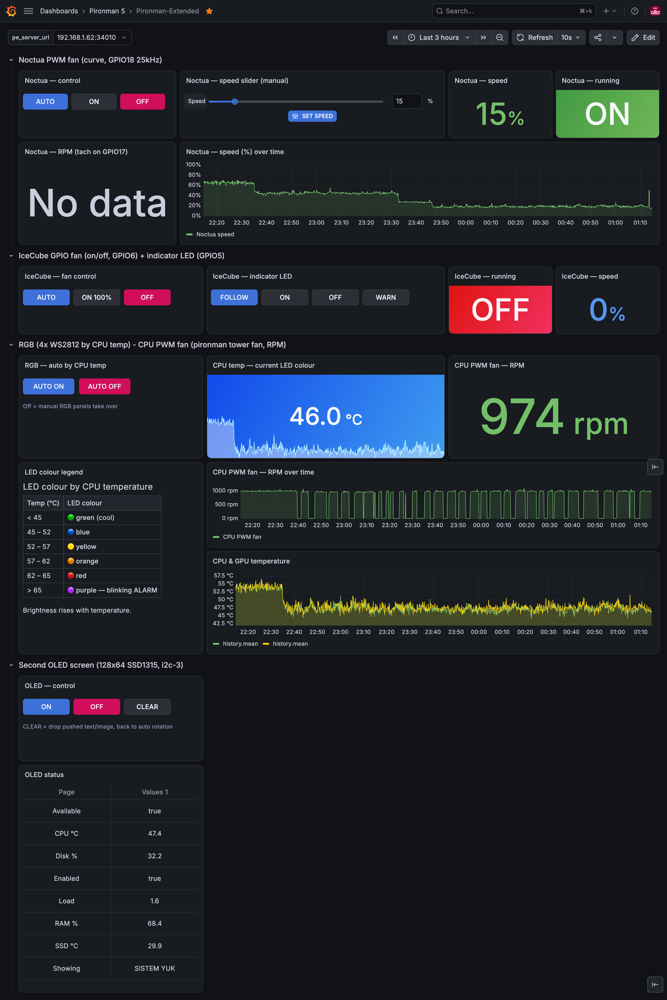

# pironman-extended

> An extension for [sunfounder/pironman5](https://github.com/sunfounder/pironman5).
> It runs alongside the official `pironman5` service and does not replace it.



One small service that extends a **SunFounder Pironman 5 / 5 Max** with the things
the stock firmware doesn't do, behind a single versioned HTTP API. Talks to the
stock `pironman5` service instead of fighting it, so the built-in dashboard/RGB
controls keep working.

## Features

- **Case-fan control** — speed curve + hysteresis for the GPIO case fan(s), silent
  on/off for 2-wire fans, true PWM + tach RPM for 4-wire fans (config-only upgrade).
- **Fan indicator LED (GPIO5/D2)** — driven independently of the fan: `follow` /
  `on` / `off` / `warn` (blinks on over-temp). It's a single-colour line, not RGB.
- **Temperature RGB** — colours the 4 onboard WS2812 LEDs by CPU temperature
  (green → blue → yellow → orange → red, purple **breathing alarm** above
  `rgb_warn_temp`), brightness ramping with temperature. Done via pironman's own
  API (`set-rgb-*`), only pushing on change, so the config file isn't thrashed.
- **Metrics** — per-fan speed/state/RPM to InfluxDB for Grafana.
- **OLED status screen** — a *second* 128×64 SSD1315 OLED (separate from Pironman's
  own) rotates CPU temp / load / SSD usage / SSD temp, and preempts with a blinking
  inverted **ALARM** on any crit threshold or system anomaly (under-voltage,
  throttle, RAM full, root read-only). The API can also draw arbitrary text or an
  image on it. See [OLED status screen](#oled-status-screen).

## API (`/api/v1`)

| Method | Path                                                                       | Body                                                                          |
| ------ | -------------------------------------------------------------------------- | ----------------------------------------------------------------------------- |
| GET    | `/health`, `/status`, `/fans`, `/fans/<name>`, `/rgb`, `/oled` | —                                                                            |
| POST   | `/fans/<name>`                                                           | `{mode?: auto\|manual\|off, percent?, led_mode?: follow\|on\|off\|warn}`         |
| POST   | `/rgb`                                                                   | `{enabled?: bool}`                                                          |
| POST   | `/oled`                                                                  | `{enabled?: bool, contrast?: 0-255}`                                        |
| POST   | `/oled/text`                                                             | `{text\|lines[], size?, align?: left\|center, invert?, duration?}`            |
| POST   | `/oled/image`                                                            | `{image_b64, fit?: contain\|stretch\|center, invert?, threshold?, duration?}` |
| POST   | `/oled/clear`                                                            | drop pushed text/image, back to auto rotation                                 |

## Grafana dashboard

[`grafana/pironman-extended.json`](grafana/pironman-extended.json) is the **Pironman-Extended**
dashboard shown above. It covers all three fans by name — **Noctua PWM fan** (curve, GPIO18),
**IceCube GPIO fan** (on/off, GPIO6) and the **CPU PWM fan** (pironman tower fan, RPM) — plus:
AUTO/manual/off buttons for both the Noctua and IceCube fans, fan-LED and RGB-auto toggles,
**second-OLED** controls (on/off/clear) with a live OLED status table, CPU temperature coloured
like the LEDs, per-fan speed/state/RPM, and CPU **and** GPU temperature for context. RPM is read
from the CPU PWM fan (which reports it); the Noctua RPM row fills in once its tach is wired to
GPIO17. Dashboard `uid` stays `case-fans` so existing links keep working.

Import it under *Dashboards → New → Import*. It expects two datasources with these UIDs:

| UID                   | Type                                                                            | Used for             |
| --------------------- | ------------------------------------------------------------------------------- | -------------------- |
| `pironman_influxdb` | InfluxDB, database`pironman5-max`                                             | all graphs and stats |
| `pironman_api`      | [Infinity](https://grafana.com/grafana/plugins/yesoreyeram-infinity-datasource/) | the button panels    |

The `pe_server_url` variable (`host:port`, default `localhost:34010`) sets where the buttons
send their requests. They call `http://${pe_server_url}/api/v1/...` **from the browser**, so
the API must be reachable from whatever machine is viewing the dashboard (the default
`"bind": "0.0.0.0"`), and it only works when Grafana itself is served over plain HTTP. For
HTTPS or remote access, use the proxy setup below instead.

## Grafana via datasource proxy (no CORS, no mixed-content)

Bind the API to `127.0.0.1` and call it through Grafana's **datasource proxy** so the
browser only ever talks to Grafana (same origin, works over HTTP-LAN and public HTTPS
alike). Add an Infinity datasource `uid: pironman_extend`, `url: http://localhost:34010`,
then point canvas/button panels at the relative path:

```
POST /api/datasources/proxy/uid/pironman_extend/api/v1/fans/case_fans   {"mode":"off"}
```

## Noctua PWM fan (4-wire) wiring

A **Noctua NF-A4x10 5V PWM** wired as a 4-wire fan: 25 kHz **hardware** PWM on
GPIO18 (RP1 `PWM0_CHAN2`, sysfs `pwmchip*/pwm2` on controller `1f00098000`) plus
an optional open-collector tach on GPIO17 for real RPM. Enable the PWM output once:

```
# /boot/firmware/config.txt  (then reboot)
dtoverlay=pwm,pin=18,func=2
```

| Noctua wire | RPi 40-pin   | Signal                      | Wire |
| ----------- | ------------ | --------------------------- | ---- |
| +5V         | **4**  | 5V                          | 🟡   |
| GND         | **6**  | GND                         | ⬛   |
| PWM         | **12** | GPIO18 (PWM0_CHAN2, 25 kHz) | 🟦   |
| Tach / RPM  | **11** | GPIO17 (input, pull-up)     | 🟩   |

```
                Raspberry Pi 5 — 40-pin header (top view)
                   ┌─────────────────────────────────┐
              3V3  │  (1) ●   ● (2)  │  5V             │
            GPIO2  │  (3) ●   ● (4)  │  5V   ●──────── 🟡 SARI   (+5V)
            GPIO3  │  (5) ●   ● (6)  │  GND  ●──────── ⬛ SİYAH  (GND)
            GPIO4  │  (7) ●   ● (8)  │  GPIO14         │
              GND  │  (9) ●   ● (10) │  GPIO15         │
   🟩 YEŞİL ──● GPIO17│(11) ●   ● (12) │  GPIO18 ●────── 🟦 MAVİ   (PWM 25kHz)
            GPIO27 │ (13) ●   ● (14) │  GND             │
                   └─────────────────────────────────┘
   🟩 green (tach) → pin 11 · 🟦 blue (PWM) → pin 12  (adjacent, same row)
```

The tach line is **open-collector** (sinks to GND, 2 pulses/rev) and the driver
enables the GPIO's internal 3.3 V pull-up, so green connects **directly** to
GPIO17 — no level shifter, never sources 5 V. Config (`config.json` fan entry):

```json
{ "name": "noctua_nf_a4x10", "pwm_chip": "1f00098000", "pwm_channel": 2,
  "pwm_freq": 25000, "min_start_percent": 30, "mode": "auto",
  "tach_pin": 17, "pulses_per_rev": 2,
  "curve": [[40,10],[45,15],[50,24],[55,36],[60,55],[63,72],[67,100]] }
```

`pwm_chip` is given as the **DT address** (`1f00098000`), not a `pwmchipN` index:
the Pi 5 has two RP1 PWM controllers whose enumeration order can swap across
reboots, but the address is stable. `curve` is an exponential-ish ramp from a
near-silent 10 % floor to 100 % at 67 °C (where the on/off IceCube fan is forced
on as a boost). Omit `tach_pin` if the green wire isn't connected (`rpm` stays
`null`).

## OLED status screen

A second, independent OLED on its **own** software I2C bus, so it never clashes
with Pironman's own 0x3c OLED on `/dev/i2c-1`.

### Which panel is this?

This is the ubiquitous generic **0.96″ 128×64 yellow/blue I²C OLED** (GME12864
class), *not* a genuine Waveshare part number — it doesn't appear on Waveshare's
[OLED page](https://www.waveshare.com/product/raspberry-pi/displays/oled.htm).

| Property      | Value                                                                   |
| ------------- | ----------------------------------------------------------------------- |
| Panel marking | **GME12864-43** (silkscreen on the flex tail)                     |
| Resolution    | **128 × 64** (not 64×32 — verify with the geometry test below) |
| Driver IC     | **SSD1315** (SSD1306-compatible)                                  |
| Colours       | **top ~16 px yellow, rest blue** (two-zone monochrome)            |
| Interface     | I²C only, 4-pin header`GND · VCC · SCL · SDA`, addr `0x3c`      |
| Voltage       | 3.3 V / 5 V (drive from**3.3 V**, see wiring)                     |

The closest genuine Waveshare equivalent is the
[**0.96inch OLED Module (C)**](https://www.waveshare.com/0.96inch-oled-module-c.htm)
(SSD1315, 128×64, upper-yellow/lower-blue) — but that one exposes a **7-pin**
SPI/I²C header (`RES DC CS CLK DIN GND VCC`), so it is *similar, not identical*.
Code treats it as a plain 128×64 SSD1306/SSD1315 over I²C, which is what matters.

### Wiring (pins chosen to clear the Noctua fan on 4/6/12)

| OLED pin | RPi 40-pin   | Signal        | Wire |
| -------- | ------------ | ------------- | ---- |
| VCC      | **17** | 3V3 (not 5V!) | 🔴   |
| SDA      | **18** | GPIO24        | 🟡   |
| SCL      | **16** | GPIO23        | 🟠   |
| GND      | **20** | GND           | 🟤   |

Module silkscreen order is `GND · VCC · SCL · SDA`; match by pin name. Power from
**3V3** so the module's I2C pull-ups stay at 3.3 V (safe for the Pi GPIO).

All four wires land in one tidy block (pins 16–20), well clear of the fan on 4/6/12:

```
                   Raspberry Pi 5 — 40-pin header (top view)
                      ┌─────────────────────────────────┐
               GPIO22 │ (15) ●   ● (16) │ GPIO23 ●────── 🟠 SCL  (turuncu)
 🔴 VCC (3V3) ───────●│ (17) ●   ● (18) │ GPIO24 ●────── 🟡 SDA  (sarı)
               GPIO10 │ (19) ●   ● (20) │ GND    ●────── 🟤 GND  (kahverengi)
                      └─────────────────────────────────┘
   🔴 VCC → pin 17 (3V3)   🟠 SCL → pin 16 (GPIO23)
   🟡 SDA → pin 18 (GPIO24)  🟤 GND → pin 20 (GND)      ⚠ VCC = 3V3, NEVER 5V
```

Mapping the module's 4-pin header (silkscreen `GND VCC SCL SDA`) to the wires and pins:

```
        OLED module header (rear)          RPi pin
        ┌─────┬─────┬─────┬─────┐
        │ GND │ VCC │ SCL │ SDA │   silkscreen
        │ 🟤  │ 🔴  │ 🟠  │ 🟡  │   wire colour
        └──┬──┴──┬──┴──┬──┴──┬──┘
           │     │     │     │
          20    17    16    18        ← RPi 40-pin number
         (GND) (3V3)(GPIO23)(GPIO24)
```

### Enable the I2C bus (one-time)

Add to `/boot/firmware/config.txt`, then reboot:

```
dtoverlay=i2c-gpio,bus=3,i2c_gpio_sda=24,i2c_gpio_scl=23
```

Verify: `ls /dev/i2c-3` and `i2cdetect -y 3` → `0x3c`. Needs `python3-luma.oled`
in the service's Python (`apt install python3-luma.oled`, or the pironman venv).

### Verify geometry (once, if unsure it's 128×64)

Draw a full-frame test pattern; all four corner labels + both diagonals must show:

```
┌─────────────────┐
│TL ╲         ╱ TR│   4 corners visible + a full border + an X
│     ╲     ╱     │   → panel is 128×64, no offset needed.
│       ╲ ╱       │   Only a centred band lit / garbage on the
│       ╱ ╲       │   sides → wrong resolution, fix oled_width/height.
│     ╱     ╲     │
│BL /         ╲ BR│
└─────────────────┘
```

### Screen catalogue (128×64)

Pages rotate in the order set by `oled_pages`. Each carries a small **icon** at
top-left so you can tell them apart at a glance. Metric pages dwell
`oled_page_dwell` s (default 60); banner/animation pages are shorter.

```
┌ cpu ──────────────┐  ┌ gauge ────────────┐  ┌ disk ─────────────┐
│▐  CPU SICAKLIK    │  │◔  SISTEM YUK      │  │▤  NVME SSD        │   (one disk
│                   │  │                   │  │                   │    page per
│  5 6  °C          │  │  4.72             │  │  3 2  %           │    drive:
│                   │  │  4 cekirdek %118  │  │  151G/469G        │    NVME, USB…)
│                   │  │  ▓▓▓▓▓▓▓░░░░░░░░░  │  │  ▓▓▓▓▓░░░░░░░░░░░  │
└───────────────────┘  └───────────────────┘  └───────────────────┘
   thermometer icon        gauge/needle icon        disk-cylinder icon

┌ temp ─────────────┐  ┌ ram ──────────────┐  ┌ clock ────────────┐
│▐  SSD SICAKLIK    │  │▥  RAM UYARI       │  │◷  TARIH / SAAT    │
│                   │  │                   │  │                   │
│  3 0  °C          │  │  9 2  %           │  │     2 3 : 4 7     │
│                   │  │  bellek dolmak    │  │                   │
│                   │  │  ▓▓▓▓▓▓▓▓▓▓▓▓▓▓░░  │  │    27.09.2026     │
└───────────────────┘  └───────────────────┘  └───────────────────┘
  RAM page shows up ONLY when RAM ≥ warn (default 90 %)     clock icon

┌ down ─────────────┐  ┌ star ─────────────┐  ┌ anim ─────────────┐
│▼  INDIRME HIZI    │  │★  FXerkan's     ★ │  │  PAC-MAN          │
│                   │  │                   │  │   ◖●  · · · ·      │  ← animated
│  9 4 0  Mb        │  │    FXerkan's      │  │                   │    (pacman,
│  Mbps  5 dk once  │  │      RPIFX        │  │  ○ ^_^  faces     │     faces,
│                   │  │                   │  │  · · YUKLENIYOR…  │     dots, cat)
└───────────────────┘  └───────────────────┘  └───────────────────┘
  Ookla/HTTP speedtest    banner (star icons)    ~5 fps sprite pages
```

Icons (drawn as 14 px monochrome sprites): `temp` thermometer, `gauge`
needle-dial, `disk` cylinder, `ram` memory chip, `clock` face, `down` download
arrow, `cpu` chip-with-pins, `star` banner.

### ALARM screen (preempts everything)

On a crit threshold or a system anomaly the rotation is interrupted by a
**blinking, colour-inverted** alarm (white background / black text, toggling every
`oled_refresh` s). If `oled_alarm_override` is set it preempts a pushed text/image
too (safety). Multiple problems cycle every `oled_alert_rot` s.

```
██████████████████████        ← inverted (white) background, blinking
███ !!! PROBLEM !!! ██
██████████████████████
█████ DUSUK VOLTAJ ███        ← problem title
██████████████████████
███ 5V besleme zayif █        ← detail
██████████████████████
```

Detected instantly (every `oled_refresh` s) from `vcgencmd get_throttled` bits →
`DUSUK VOLTAJ` / `THROTTLE` / `FREKANS KISILI` / `ISI LIMITI`; root FS read-only →
`DISK SALT-OKUR`; RAM ≥ crit → `RAM DOLDU`; plus any metric over its crit threshold
(`CPU KRITIK`, `SSD KRITIK`, `DISK DOLDU`, `YUK KRITIK`).

### Draw your own

```bash
# text (2 lines, auto-sized, stays 15 s then back to rotation)
curl -sX POST localhost:34010/api/v1/oled/text \
  -d '{"lines":["MERHABA","rpifx"],"duration":15}'

# image (any PNG/JPG/BMP, base64; 1-bit dithered to 128x64)
curl -sX POST localhost:34010/api/v1/oled/image \
  -d "{\"image_b64\":\"$(base64 -w0 logo.png)\",\"fit\":\"contain\"}"

curl -sX POST localhost:34010/api/v1/oled/clear      # back to auto
curl -sX POST localhost:34010/api/v1/oled -d '{"enabled":false}'   # blank it
```

`duration` omitted or `0` = show until cleared.

### Configuration (`config.json` → `oled_*`)

| Key                                                  | Default                                 | Meaning                                 |
| ---------------------------------------------------- | --------------------------------------- | --------------------------------------- |
| `oled_enabled`                                     | `true`                                | master on/off                           |
| `oled_i2c_port` / `oled_i2c_addr`                | `3` / `"0x3c"`                      | which bus + address                     |
| `oled_width` / `oled_height`                     | `128` / `64`                        | panel resolution                        |
| `oled_pages`                                       | see below                               | rotation order (tokens)                 |
| `oled_page_dwell`                                  | `60`                                  | seconds per metric page                 |
| `oled_refresh`                                     | `2`                                   | scan/redraw tick (anomaly latency)      |
| `oled_anim_dwell` / `oled_anim_frame`            | `8` / `0.2`                         | anim page length / frame delay (~5 fps) |
| `oled_banner` / `oled_banner_dwell`              | `["FXerkan's","RPIFX"]` / `6`       | banner text + duration                  |
| `oled_thresholds`                                  | `{cpu,load,ram,disk,ssd:[warn,crit]}` | alarm/warn limits (load is per-core)    |
| `oled_disk_min_gb`                                 | `16`                                  | ignore drives smaller than this         |
| `oled_speedtest_interval` / `oled_speedtest_url` | `21600` / Cloudflare                  | speedtest period + HTTP fallback URL    |
| `oled_alarm_override`                              | `true`                                | alarms preempt pushed text/image        |
| `oled_contrast`                                    | `255`                                 | 0–255                                  |

**Page tokens** for `oled_pages`: `cpu` `load` `ssd` (metrics) · `disks` (expands
to one page **per drive**, name + size + usage) · `ram` (shown **only** when RAM ≥
warn) · `clock` (date/time) · `speed` (download Mbps) · `banner` · `anim:pacman`
`anim:faces` `anim:dots` `anim:cat`. Reorder/remove freely; restart after editing.

> **Speedtest:** uses the Ookla `speedtest` CLI if installed, else `speedtest-cli`,
> else a plain HTTP download from `oled_speedtest_url` (works out of the box, no
> install). For accurate Ookla numbers: `apt install speedtest` (Ookla repo) or
> `pip install speedtest-cli`.

Apply changes with `sudo systemctl restart pironman-extend`.

## Install

```
/etc/systemd/system/pironman-extend.service   # Before=pironman5.service (grabs GPIO first)
/home/<user>/PROJECTs/pironman-extend/{pironman_extend.py,config.json,state.json}
```

`pironman-extend` starts before `pironman5` to claim GPIO5/6 (pironman then auto-disables
its own gpio_fan); the RGB loop retries until pironman's API is up. Stdlib + `lgpio` only.

Self-check: `python3 pironman_extend.py --selftest`

`state.json` holds runtime state (e.g. the RGB on/off toggle), is created on the fly, and is not tracked in git.
